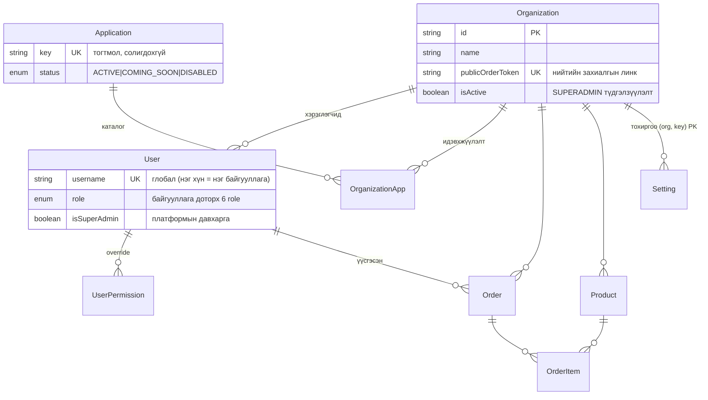

# ocirrf — Платформын архитектур

ocirrf нь Odoo маягийн **олон дотоод системийн платформ**: нэг deployment
дээр олон байгууллага (tenant) бүртгүүлж, каталогоос app-уудаа
идэвхжүүлж ашиглана. "Урсгал" (агуулах/захиалга/хүргэлт/санхүү) нь
эхний app; Санхүү, HR зэрэг нь дараагийн app-ууд.

## 1. Платформын давхаргууд

```
Нийтийн landing (/)  →  Auth (/login, /signup)  →  App-ууд (/dashboard…)  ⇄  Launcher (/launcher)
   app каталог            байгууллага бүртгэх        шууд ажлын орчин            бүх app (switcher-ээс)
```

- **`/`** — нэвтрэлтгүй нүүр: платформын танилцуулга + app card grid
  (`GET /api/platform/apps`). ACTIVE app дарж `/apps/:key` дэлгэрэнгүй рүү.
- **`/signup`** — байгууллага + эхний ADMIN нэг transaction-д үүсээд шууд
  нэвтэрнэ; цөм "ursgal" app автоматаар идэвхжинэ.
- **`/launcher`** — байгууллагын app каталог: идэвхтэй app-ууд
  (`GET /api/platform/my-apps`) + идэвхжүүлж болох ACTIVE app-ууд.
  Нэвтэрсний дараах анхны хуудас БИШ — login шууд цөм app руу
  (`/dashboard`, жолооч `/deliveries`); энд switcher-ийн «Бүх апп»-аар орно.
- **App дотор** — app бүр өөрийн nav/route-тэй; topbar-ын app switcher
  (grid icon) app хооронд шилжүүлнэ.
- **`/platform-admin`** — зөвхөн SUPERADMIN: байгууллагууд, каталог.
  Системийн алдааны лог (`GET /api/admin/errors`) мөн зөвхөн SUPERADMIN —
  лог нь платформын түвшний файл тул байгууллагын админд задлахгүй.

## 2. Multi-tenancy (байгууллагын тусгаарлалт)

**Загвар:** нэг Postgres DB + бүх scoped хүснэгтэд `organizationId`
(NOT NULL + FK). Байгууллага бүрийн өгөгдөл мөрийн түвшинд тусгаарлагдана.

**Механизм:** request бүр AsyncLocalStorage store-той эхэлж
(`src/org/org-context.ts`), `JwtStrategy` (нэвтэрсэн хэрэглэгч) эсвэл
нийтийн захиалгын token (`Organization.publicOrderToken`) байгууллагыг
онооно. `src/prisma/org-scope.extension.ts` нь scoped model-ийн query
бүрт `organizationId` шүүлтийг **автоматаар** нэмнэ.

**Fail closed:** context байхгүй үед scoped query алдаа шидэж унана —
шүүлтээ мартсан код чимээгүй бүх байгууллагын өгөгдөл буцаахын оронд
чанга алддаг. Давхар хамгаалалт: create бүрт explicit `organizationId`,
NOT NULL + FK нь мартагдсан бичилтийг DB түвшинд барина.

**Bypass хэзээ зөвшөөрөгдөх вэ** (`OrgContext.runBypassed`, grep-ээр
аудитлагдана):
1. Auth bootstrap — login/refresh/JwtStrategy (байгууллага ХАРААХАН
   тодорхойгүй үе), SSE token шалгалт, uploads guard-ийн эзэмшил шалгалт
2. SUPERADMIN консолын route-ууд — бүх байгууллагыг харах нь зорилго
   (SuperAdminGuard-аар хамгаалагдсан)
3. Глобал model-ууд (Application, Organization) bypass ШААРДДАГГҮЙ —
   SCOPED_MODELS жагсаалтад байхгүй тул extension огт үйлчилдэггүй

Raw SQL (`$queryRaw`) extension-д хамрагддаггүй — гар шүүлттэй
(finance/dashboard/analytics-ийн aggregate-ууд, lock.util).

## 3. App Registry

- **Application** — платформын ГЛОБАЛ каталог: key (тогтмол, солигдохгүй),
  нэр/тайлбар, icon, өнгө, статус, эрэмбэ.
- **OrganizationApp** — байгууллага бүрийн идэвхжүүлэлт (org-scoped,
  `@@unique([organizationId, applicationId])`, org устахад Cascade).

**Статусын урсгал:**

```
COMING_SOON ──(SUPERADMIN консол)──► ACTIVE ──► идэвхжүүлж болно
     │                                 │
     └────────► DISABLED ◄─────────────┘   (каталогоос нуугдана;
                                            идэвхжүүлэлттэй ч my-apps-д гарахгүй)
```

Цөм "ursgal" app унтраагдахгүй (байгууллага app-гүй мухардахаас сэргийлнэ).

## 4. Эрхийн давхаргууд

```
1. ПЛАТФОРМ   User.isSuperAdmin     бүх байгууллага, каталог (консол)
2. БАЙГУУЛЛАГА 6 role               ADMIN / MANAGER / OPERATOR / DRIVER /
              + permission key-үүд  WAREHOUSE / SELLER; ROLE_DEFAULTS
                                    матриц + хэрэглэгч бүрийн override
3. APP ДОТОР  permission key-үүд    orders.view … platform.manage_apps
                                    (35 key, permission-keys.ts)
```

- SUPERADMIN нь байгууллагын role-уудаас **бүрэн тусдаа** — зөвхөн
  `scripts/make-superadmin.ts`-ээр олгогдоно, UI-гаас олгогдохгүй.
- `platform.manage_apps` — байгууллага ДОТРОО app идэвхжүүлэх эрх
  (ADMIN default).
- Effective permission = role default ± хэрэглэгчийн override
  (`UserPermission`), 60с кэштэй.

## 5. Дата загварын харилцаа



## 6. Frontend модулийн стандарт

`frontend/src/apps/<key>/` — app бүр manifest-тэй:

```js
{ key, nameMn, icon, color, basePath, mountPath, loadRoutes, navItems, requiredPermissions }
```

`src/apps/index.js`-ийн `APP_MANIFESTS`-ээс платформ бүрхүүл (App.jsx)
route-уудаа, AppShell nav/switcher-ээ угсарна — шинэ app нэмэхэд App.jsx-д
гар хүрдэггүй. Бүрэн дараалал README-ийн "Шинэ app нэмэх" хэсэгт.

**Lazy loading (app бүр өөрийн bundle):** манифест `routes`-оо статикаар
биш `loadRoutes: () => import('./routes')`-ээр өгнө. App.jsx нь app бүрийг
`<Route path={mountPath} element={<AppRoutes manifest/>}>` дор угсарч,
`AppRoutes` нь `React.lazy` + `Suspense` (fallback: шилэн `AppLoading`)-ээр
route модыг татна. Vite `routes.jsx`-ээс эхэлсэн бүх модулийг
`assets/app-<key>-<hash>.js` chunk болгодог (vite.config.js-ийн
`chunkFileNames`). Үр дүн: login/launcher зэрэг платформын хуудсууд үндсэн
bundle-д, ursgal-ийн 28 хуудас `app-ursgal-*.js`-д (≈308 kB / gzip 74 kB);
дараагийн app бүр автоматаар өөрийн chunk-той. `mountPath` нь prefix-тэй
(`/<key>/*`) байх ёстой; ursgal нь түүхэн шалтгаанаар `/*` тул
`manifestsInMountOrder()` түүнийг хамгийн сүүлд угсардаг.

## 7. Тестийн бүтэц

| Спек | Юуг батална |
|---|---|
| `api-v2.e2e-spec.ts` | Урсгал app-ийн бүрэн ажиллагаа (235 тест) |
| `tenant-isolation.e2e-spec.ts` | Байгууллагын тусгаарлалт (cross-tenant 404, дугаарлалт, uploads) |
| `platform-apps.e2e-spec.ts` | App Registry, идэвхжүүлэлт, SPA |
| `platform-admin.e2e-spec.ts` | SUPERADMIN консол, түдгэлзүүлэлт, каталог |
| `platform-flow.e2e-spec.ts` | Бүтэн урсгал нэг integration тестээр |

Тестүүд тусдаа `ocirrf_test` DB дээр ажиллана (`test/jest-e2e.setup.js`).
