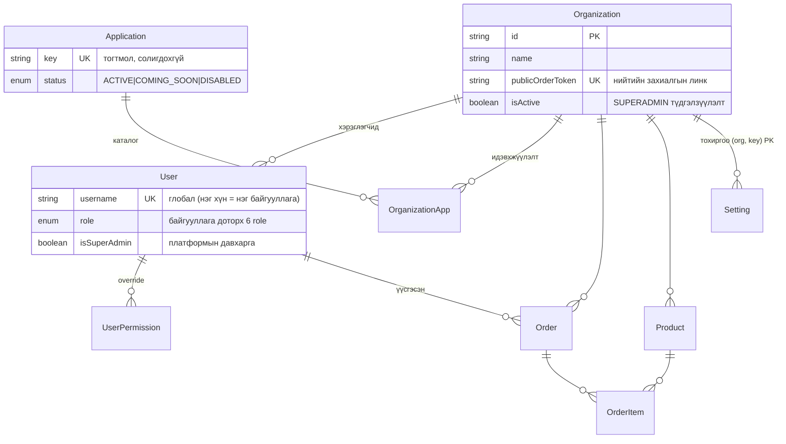

# ocirrf — Платформын архитектур

ocirrf нь Odoo маягийн **олон дотоод системийн платформ**: нэг deployment
дээр олон байгууллага (tenant) бүртгүүлж, каталогоос app-уудаа
идэвхжүүлж ашиглана. "Урсгал" (агуулах/захиалга/хүргэлт/санхүү) нь
эхний app; Санхүү, HR зэрэг нь дараагийн app-ууд.

## 1. Платформын давхаргууд

```
Нийтийн landing (/)  →  Auth (/login, /signup)  →  ХАБ (/launcher)  →  Системүүд (/dashboard, /<key>/…)
   10 системийн каталог    байгууллага бүртгэх       10 card, төлөвөөр     тухайн системийн орчин
```

- **`/`** — нэвтрэлтгүй нүүр: платформын танилцуулга + app card grid
  (`GET /api/platform/apps`). ACTIVE app дарж `/apps/:key` дэлгэрэнгүй рүү.
- **`/signup`** — байгууллага + эхний ADMIN нэг transaction-д үүсээд шууд
  нэвтэрнэ; цөм "ursgal" app автоматаар идэвхжинэ.
- **`/launcher`** — ocirrf ХАБ, нэвтэрсний дараах нүүр: каталогийн 11
  систем (`GET /api/platform/apps`) байгууллагын идэвхжүүлэлттэй
  (`GET /api/platform/my-apps`) нийлж card бүр enabled / available / soon
  төлөвтэй. Enabled card → манифестийн basePath (ursgal: `/dashboard`);
  жолооч хабыг алгасаж шууд `/deliveries`. Системийн дотроос буцах зам:
  app switcher-ийн «Бүх апп».
- **App дотор** — app бүр өөрийн nav/route-тэй; topbar-ын app switcher
  (grid icon) app хооронд шилжүүлнэ.
- **`/platform-admin`** — зөвхөн SUPERADMIN: байгууллагууд, каталог.
  Системийн алдааны лог (`GET /api/admin/errors`) мөн зөвхөн SUPERADMIN —
  лог нь платформын түвшний файл тул байгууллагын админд задлахгүй.

## 2. Multi-tenancy (байгууллагын тусгаарлалт)

**Загвар:** нэг Postgres DB + бүх scoped хүснэгтэд `organizationId`
(NOT NULL + FK). Байгууллага бүрийн өгөгдөл мөрийн түвшинд тусгаарлагдана.

**Механизм:** request бүр AsyncLocalStorage store-той эхэлж
(`src/org/org-context.ts`), `JwtStrategy` (нэвтэрсэн хэрэглэгч) эсвэл
нийтийн захиалгын token (`Organization.publicOrderToken`) байгууллагыг
онооно. `src/prisma/org-scope.extension.ts` нь scoped model-ийн query
бүрт `organizationId` шүүлтийг **автоматаар** нэмнэ.

**Fail closed:** context байхгүй үед scoped query алдаа шидэж унана —
шүүлтээ мартсан код чимээгүй бүх байгууллагын өгөгдөл буцаахын оронд
чанга алддаг. Давхар хамгаалалт: create бүрт explicit `organizationId`,
NOT NULL + FK нь мартагдсан бичилтийг DB түвшинд барина.

**Bypass хэзээ зөвшөөрөгдөх вэ** (`OrgContext.runBypassed`, grep-ээр
аудитлагдана):
1. Auth bootstrap — login/refresh/JwtStrategy (байгууллага ХАРААХАН
   тодорхойгүй үе), SSE token шалгалт, uploads guard-ийн эзэмшил шалгалт,
   `register-org` (байгууллага дөнгөж үүсэж буй тул context тавих
   боломжгүй; блок доторх бичилт бүр `organizationId`-г тодоор өгнө)
2. SUPERADMIN консолын route-ууд — бүх байгууллагыг харах нь зорилго
   (SuperAdminGuard-аар хамгаалагдсан)
3. Глобал model-ууд (Application, Organization) bypass ШААРДДАГГҮЙ —
   SCOPED_MODELS жагсаалтад байхгүй тул extension огт үйлчилдэггүй

Raw SQL (`$queryRaw`) extension-д хамрагддаггүй — гар шүүлттэй
(finance/dashboard/analytics-ийн aggregate-ууд, lock.util).

## 3. App Registry

- **Application** — платформын ГЛОБАЛ каталог: key (тогтмол, солигдохгүй),
  нэр/тайлбар, icon, өнгө, статус, эрэмбэ.
- **OrganizationApp** — байгууллага бүрийн идэвхжүүлэлт (org-scoped,
  `@@unique([organizationId, applicationId])`, org устахад Cascade).

**Статусын урсгал:**

```
COMING_SOON ──(SUPERADMIN консол)──► ACTIVE ──► идэвхжүүлж болно
     │                                 │
     └────────► DISABLED ◄─────────────┘   (каталогоос нуугдана;
                                            идэвхжүүлэлттэй ч my-apps-д гарахгүй)
```

Цөм "ursgal" app унтраагдахгүй (байгууллага app-гүй мухардахаас сэргийлнэ).

## 4. Эрхийн давхаргууд

```
1. ПЛАТФОРМ   User.isSuperAdmin     бүх байгууллага, каталог (консол)
2. БАЙГУУЛЛАГА 6 role               ADMIN / MANAGER / OPERATOR / DRIVER /
              + permission key-үүд  WAREHOUSE / SELLER; ROLE_DEFAULTS
                                    матриц + хэрэглэгч бүрийн override
3. APP ДОТОР  permission key-үүд    orders.view … platform.manage_apps
                                    (35 key, permission-keys.ts)
```

- SUPERADMIN нь байгууллагын role-уудаас **бүрэн тусдаа** — зөвхөн
  `scripts/make-superadmin.ts`-ээр олгогдоно, UI-гаас олгогдохгүй.
- `platform.manage_apps` — байгууллага ДОТРОО app идэвхжүүлэх эрх
  (ADMIN default).
- Effective permission = role default ± хэрэглэгчийн override
  (`UserPermission`), 60с кэштэй.

## 5. Дата загварын харилцаа



## 6. Frontend модулийн стандарт

`frontend/src/apps/<key>/` — app бүр manifest-тэй:

```js
{ key, nameMn, icon, color, basePath, mountPath, loadRoutes, navItems, requiredPermissions }
```

`src/apps/index.js`-ийн `APP_MANIFESTS`-ээс платформ бүрхүүл (App.jsx)
route-уудаа, AppShell nav/switcher-ээ угсарна — шинэ app нэмэхэд App.jsx-д
гар хүрдэггүй. Бүрэн дараалал README-ийн "Шинэ app нэмэх" хэсэгт.

**Lazy loading (app бүр өөрийн bundle):** манифест `routes`-оо статикаар
биш `loadRoutes: () => import('./routes')`-ээр өгнө. App.jsx нь app бүрийг
`<Route path={mountPath} element={<AppRoutes manifest/>}>` дор угсарч,
`AppRoutes` нь `React.lazy` + `Suspense` (fallback: шилэн `AppLoading`)-ээр
route модыг татна. Vite `routes.jsx`-ээс эхэлсэн бүх модулийг
`assets/app-<key>-<hash>.js` chunk болгодог (vite.config.js-ийн
`chunkFileNames`). Үр дүн: login/launcher зэрэг платформын хуудсууд үндсэн
bundle-д, ursgal-ийн 28 хуудас `app-ursgal-*.js`-д (≈308 kB / gzip 74 kB);
дараагийн app бүр автоматаар өөрийн chunk-той. `mountPath` нь prefix-тэй
(`/<key>/*`) байх ёстой; ursgal нь түүхэн шалтгаанаар `/*` тул
`manifestsInMountOrder()` түүнийг хамгийн сүүлд угсардаг.

## 7. Тестийн бүтэц

| Спек | Юуг батална |
|---|---|
| `api-v2.e2e-spec.ts` | Урсгал app-ийн бүрэн ажиллагаа (235 тест) |
| `tenant-isolation.e2e-spec.ts` | Байгууллагын тусгаарлалт (cross-tenant 404, дугаарлалт, uploads) |
| `platform-apps.e2e-spec.ts` | App Registry, идэвхжүүлэлт, SPA |
| `platform-admin.e2e-spec.ts` | SUPERADMIN консол, түдгэлзүүлэлт, каталог |
| `platform-flow.e2e-spec.ts` | Бүтэн урсгал нэг integration тестээр |

Тестүүд тусдаа `ocirrf_test` DB дээр ажиллана (`test/jest-e2e.setup.js`).

## 8. Масштабын дүрмүүд (олон app-ийн өмнөх суурь)

Платформ дээр Санхүү, HR зэрэг app нэмэгдэхээс ӨМНӨ тогтоосон дүрмүүд.
Одоогийн кодыг албадан refactor хийхгүй; шинэ app болон шинэ endpoint бүр
эдгээрийг дагана (README-ийн "Шинэ app нэмэх" checklist-д товчоор).

### 8.1 Pagination заавал

Жагсаалт буцаадаг endpoint бүр ЭХНЭЭСЭЭ pagination-тай. Стандарт нь
ursgal-ийн одоогийн хэв маяг (`QueryOrdersDto`, `OrdersService.findAll`,
`FinanceService.findEntries`, `NotificationsService.list`):

```ts
// Query DTO
@IsOptional() @Type(() => Number) @IsInt() @Min(1)           page?: number = 1;
@IsOptional() @Type(() => Number) @IsInt() @Min(1) @Max(100) limit?: number = 20;
// Service
const [items, total] = await Promise.all([
  prisma.x.findMany({ where, orderBy, skip: (page - 1) * limit, take: limit }),
  prisma.x.count({ where }),
]);
return { items, total, page, limit };
```

`take`-гүй `findMany` нь зөвхөн байгууллага дотроо хязгаартай өсөлттэй
reference жагсаалтад (ангилал, компани, ажилтан — арваар хэмжигддэг)
тайлбартайгаар зөвшөөрөгдөнө. Хэрэглэгчийн үйлдлээр хязгааргүй өсдөг
хүснэгт (захиалга, хөдөлгөөн, мэдэгдэл, санхүүгийн бичилт) бүхэлдээ
буцаагдахгүй. Cursor pagination нь төгсгөлгүй гүйлгээтэй feed-д
(мэдэгдэл г.м.) сонголтоор — page/limit нь default.

### 8.2 Module-ийн хил

- **Backend:** app = NestJS module. Бусад app-тай зөвхөн тухайн module-ийн
  `exports`-д зарласан public service/interface-ээр харилцана — module-ийг
  `imports`-д нэмж, service-ийг DI-аар авна (загвар: `OrderRequestsModule`
  → `OrdersModule` → `OrdersService`). `../<өөр-app>/<x>.service` файлыг
  шууд import хийх нь тухайн service `exports`-д БАЙГАА үед л зөвшөөрөгдөнө.
  Бусад app-ийн Prisma model руу шууд бичихгүй — тэр app-ийн service-ээр
  (stock хөдөлгөөн → StockService/applyBatchDelta, төлбөр → PaymentsService).
  Платформын дундын дэд бүтэц (PrismaService, OrgContext, PermissionsService,
  NotificationsService, uploads util) бүх app-д нээлттэй.
- **Frontend:** `src/apps/<key>/` дотроос `src/apps/<өөр-key>/…` import
  хийхгүй (lazy chunk-ууд бие биенээ татаж эхэлнэ). Хуваалцах компонент,
  туслах, context нь `src/components`, `src/lib`, `src/context`-д.

### 8.3 Удаан ажиллагааны дүрэм (background job)

3-5 секундээс удаан үргэлжлэх БОЛОМЖТОЙ үйлдэл — том CSV/XLSX export, олон
мянган мөрийн нэгтгэл тайлан, зураг боловсруулалт, олон хүлээн авагчид
илгээх мессеж — синхрон HTTP endpoint дотор хийгдэхгүй. Ийм endpoint-ийг
кодод `// TODO(background-job)` гэж тэмдэглэж, хэрэгжилтийг тусдаа шийднэ:
хүсэлт 202 + job id буцааж, ажил worker дээр гүйцэтгэгдэж, үр дүн (файл,
төлөв) тусдаа endpoint-оос уншигдана. Дэд бүтэц нь **BullMQ + Redis** —
ирээдүйд нэмэгдэнэ, одоо суулгаагүй (нэг Postgres + нэг Node процесс
хэвээр). Одоогийн CSV тайлангууд огнооны мужаар (default 30 хоног)
хязгаарлагдсан тул босго доор байна; муж/мөрийн тоо өсвөл энэ дүрэмд
шилжинэ.

### 8.4 Index дүрэм

Org-scope extension query бүрт `organizationId = ?` шүүлт нэмдэг. Тиймээс
org-scoped model бүр **organizationId-ээр ЭХЭЛСЭН** index-тэй байна — тэр
хүснэгтийн үндсэн жагсаалтын эрэмбэ/шүүлттэй composite
(`@@index([organizationId, createdAt])`, `[organizationId, status, createdAt]`
г.м.). `@@unique([organizationId, X])` / `@@id([organizationId, key])`
байвал index-ийн үүргийг давхар гүйцэтгэдэг тул дан `[organizationId]`
давхардуулахгүй. 2026-09-03-ны аудит (`*_org_scoped_indexes` migration)
бүх 16 scoped model-ийг энэ дүрэмд нийцүүлсэн; шинэ model нэмэхэд
`prisma migrate diff --from-config-datasource --to-schema` зөрүү 0 гэдгийг
батална.

### 8.5 SSE дүрэм (нэг нэгдсэн суваг)

App бүр өөрийн EventSource/SSE endpoint нээхгүй. Бодит цагийн мэдэгдэл
платформын НЭГ сувгаар дамжина: backend-д `NotificationsService` (хэрэглэгч
тутам Subject-ийн олонлог, дээд тал нь 8 холболт, access token дуусахад
хаагдана) → `/api/notifications/stream`; app-ууд зөвхөн
`NotificationsService.notify*` методуудыг дуудна, frontend-д AppShell нэг
EventSource барьж `notif:push` event-ээр хуудсуудад тараана. Одоогийн
notification бүтэц энэ зарчимд бүрэн нийцэж байна (ursgal-ийн бүх модуль
нэг service-ээр дамжуулдаг, тусдаа stream байхгүй) — өөрчлөлт хэрэггүй.
